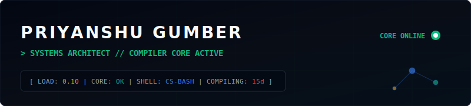
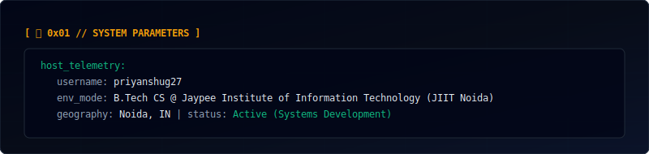
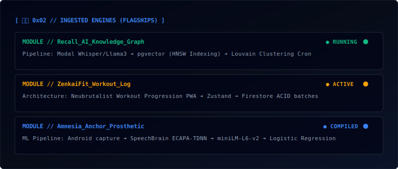
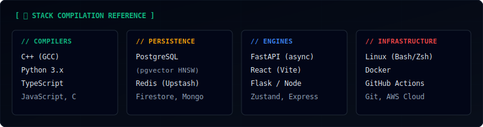
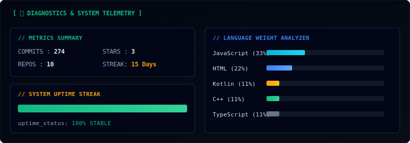

# Priyanshu Gumber

  

---

  

---

  

---

  

---

  

---

## 🔌 Socket Connects

  
  &nbsp;&nbsp;
  
  &nbsp;&nbsp;
  

---

  <em>"Talk is cheap. Show me the code." — Linus Torvalds</em>

